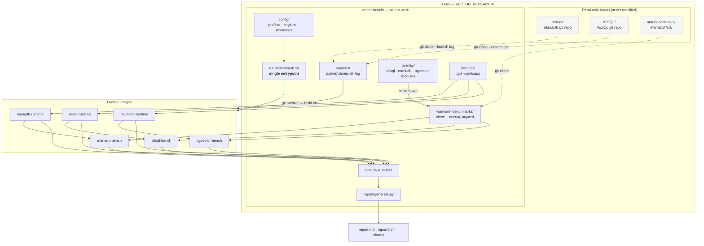
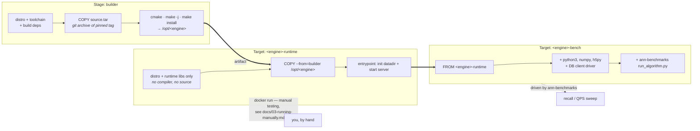
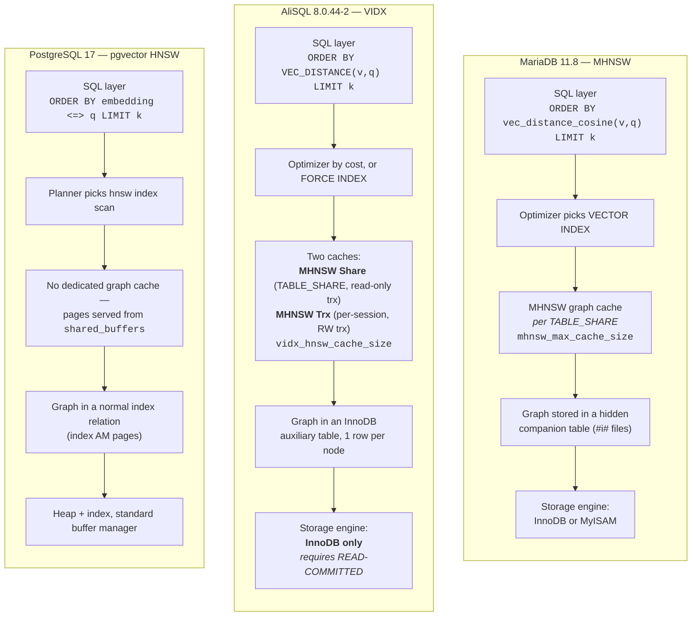
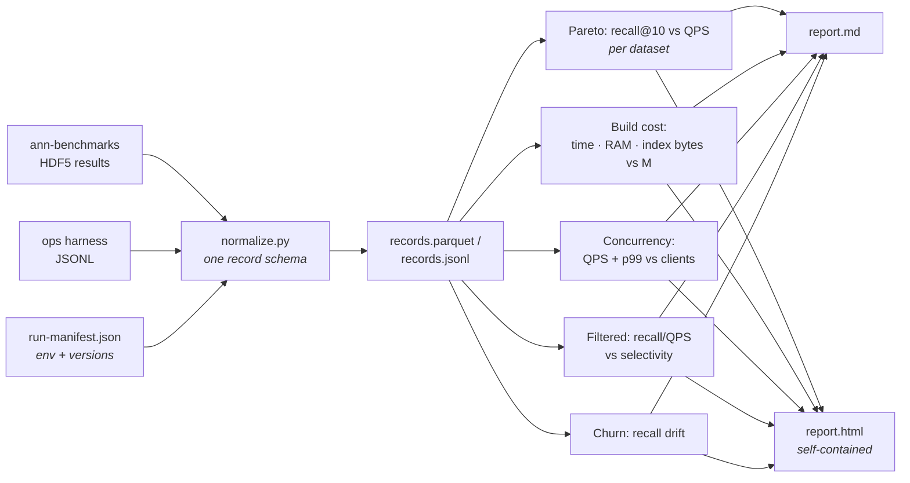

# Architecture

## 1. System overview

`vector-bench` is a self-contained directory. It never writes to the three vendor
repositories — it reads them, clones from them into its own `sources/`, and does
all work under its own tree.



The key structural point: **two independent measurement paths write into one
results directory.**

- The `*-bench` images run under ann-benchmarks and produce recall/QPS.
- The `*-runtime` images are driven directly by our ops harness and produce build
  cost, concurrency, filtered-search and churn numbers.

Both emit the same JSON-lines record schema, so the report generator does not
care which path produced a given metric.

## 2. Container build model

Each engine has one Dockerfile with two published targets.



`SOURCE_MODE` build-arg selects where the source tarball comes from:
`local` (default — `git archive` out of `sources/`) or `upstream` (clone from
GitHub inside the builder, for publishing a recipe others can rebuild).

## 3. Vector-search internals, side by side

The three engines solve the same problem with materially different plumbing.
This is what the benchmark is actually measuring.



Consequences that show up in the results:

- **Cache design drives concurrency behaviour.** MariaDB's single per-share cache
  and AliSQL's share+transaction split respond differently as client count rises.
  pgvector inherits PostgreSQL's buffer manager, which is mature but not
  vector-aware.
- **Graph-in-a-table (MariaDB, AliSQL) vs graph-in-an-index-AM (pgvector)**
  changes what "index size on disk" means and how build cost scales.
- **`ef_construction` is only tunable in pgvector**, so build-quality tradeoffs
  are not symmetric.

## 4. Benchmark data flow

```mermaid
sequenceDiagram
    autonumber
    participant U as run-benchmark.sh
    participant D as datasets/
    participant I as Docker image
    participant E as Engine (in container)
    participant R as results/&lt;run-id&gt;/

    U->>U: resolve profile + engines + datasets<br/>collect sysinfo, write run-manifest.json
    U->>D: fetch HDF5 dataset (train, test, ground-truth)
    U->>I: build if image digest missing

    rect rgb(240, 246, 255)
    note over U,R: Path A — recall / QPS (ann-benchmarks)
    U->>I: run.py --algorithm &lt;engine&gt; --dataset … --runs N
    I->>E: start server, CREATE TABLE + VECTOR INDEX
    E->>E: ingest train vectors, build HNSW
    loop each ef_search in grid
        I->>E: query all test vectors, k=10
        E-->>I: neighbour ids + per-query latency
    end
    I->>R: results/&lt;dataset&gt;/&lt;k&gt;/&lt;engine&gt;/*.hdf5
    end

    rect rgb(245, 255, 245)
    note over U,R: Path B — ops harness
    U->>E: docker run &lt;engine&gt;-runtime (cpuset + mem limit)
    U->>E: ingest, timed; build index, timed
    E-->>U: build wall/CPU time, peak RSS (cgroup), index bytes
    U->>E: concurrency sweep 1→32 clients
    E-->>U: QPS + p50/p95/p99
    U->>E: filtered search @ 1% / 10% / 50% selectivity
    E-->>U: recall vs recomputed filtered ground truth
    U->>E: churn 10% / 25%, re-measure
    U->>R: results/ops/*.jsonl
    end

    U->>R: finalize manifest (durations, image digests)
    U->>U: report/generate.py
    U->>R: report.md · report.html · charts/*.svg
```

## 5. Results pipeline



A record is one row of:

```
run_id, engine, engine_version, dataset, metric_space, pass (normalized|tuned),
storage_engine, M, ef_construction, ef_search, k, clients, phase,
recall_at_k, qps, latency_p50_ms, latency_p95_ms, latency_p99_ms,
build_wall_s, build_cpu_s, peak_rss_bytes, index_bytes, ingest_rows_per_s,
selectivity, churn_fraction, timestamp
```

Unused fields are null. One flat schema keeps the report generator simple and
makes the raw data trivially queryable with any tool.
